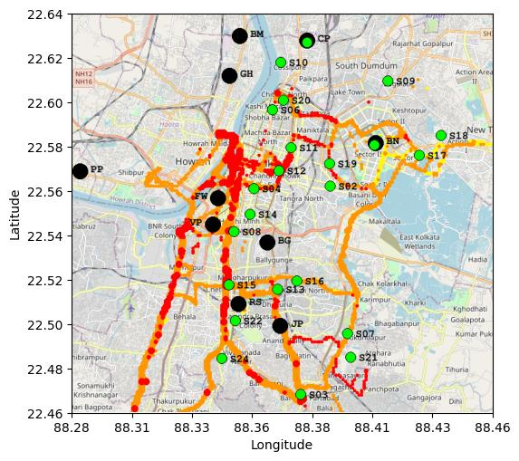
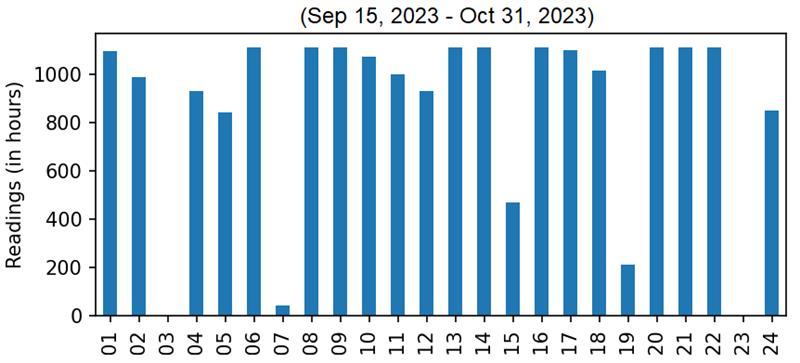
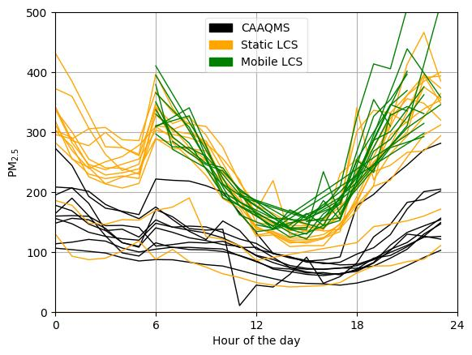
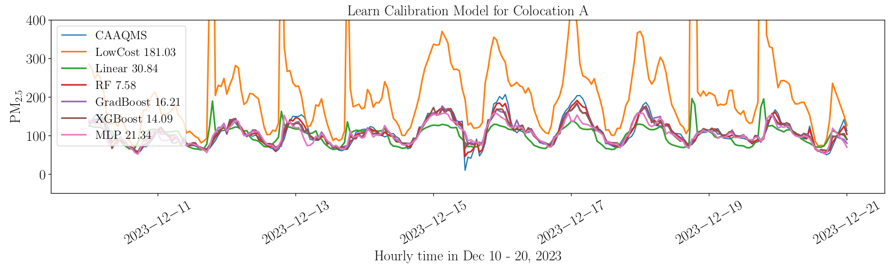
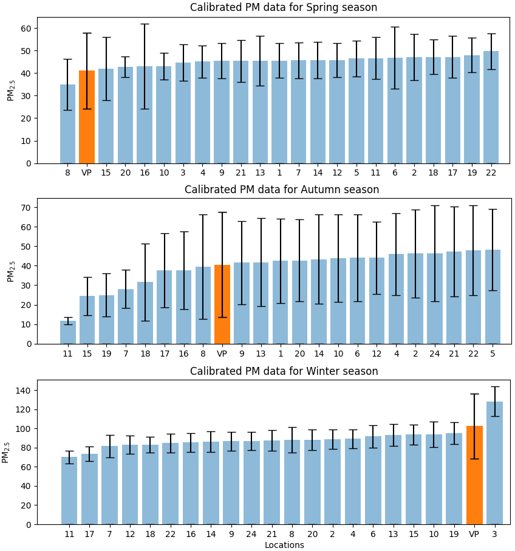

## Kolkata PM2.5 Pollution Dataset 

[Kolkata Pollution Website](http://cse.iitd.ac.in/pollutiondata/kolkata)

_Locations-staticLCS.csv_ contains the latitude-longitude of the static sensors installed.

_croissant-metadata.json_ contains the Croissant Metadata.

### Seasons

| Season |   Duration                  |
|:------:|:---------------------------:|
| Spring | Mar 27, 2023 - Apr 27, 2023 |
| Autumn | Sep 15, 2023 - Oct 31, 2023 |
| Winter | Dec 01, 2023 - Jan 31, 2024 |

### Calibration with CAAQMS sensor

#### 1. Pollution Sensor placements in Kolkata region
CAAQMS sensors are in Black, whereas our Low Cost Static Sensors are in Green. The traces in red/orange/yellow colours depict the trajectories covered by different buses having our low cost mobile sensors. Red colour depict high PM2.5 whereas orange/yellow depict relatively lower PM2.5

#### 2. Number of hourly samples available in the datasets (Y-axis) for different low-cost sensors (X-axis) for Sep15-Oct31 2023
Some sensors are facing power / network connection / maintenance issues and hence less data is available for such sensors.

#### 3. CAAQMS Data vs Low-Cost Sensor Data for an arbitrary day (Dec 15, 2023)
Most of the low-cost sensor data is showing relatively higher PM2.5 as compared to CAAQMS data, which signify need for calibration.

#### 4. Data fitting methods: Given the trusted gold data from co-located or nearby CAAQMS, we employ different supervised learning algorithms/models to fit LCS data to CAAQMS.
1. Linear Regression: We use a linear model without interceptor for the calibration. The final PM is a linear combination of T and RH.
2. Random Forest (RF): An RF ensemble, with 100 estimators, is one of the best algorithms for pollution related analysis [Chauhan et al., 2023].
3. GradBoost: Gradient boosting decision trees are an ensemble utilized to decrease the Bias error.
4. XGBoost: Extreme Gradient Boosting is a scalable and distributed gradient-boosted decision tree machine learning library, which provides parallel tree boosting.
5. Multilayer perceptron (MLP): We utilize neural models, of 10 x 50 x 10 hidden layers, to approximate the calibration function.

Considering the simplicity, good generalization, and being a model of choice in recent state-of-the-arts [Nobell et al., 2023], Linear Regression is our default calibration model across different seasons.

#### 5. Sorted mean PM2.5 plot for different LCS locations (in blue color)
Some locations experience higher absolute PM due to hyper-local factors. The orange location (VP) is a reference CAAQMS sensor for selected for the calibration purpose.

### Sample Data

|    |    lat |  long |      time      |     pm      |
|---:|:------:|:-----:|:--------------:|:-----------:|
|  1 |  22.46	| 88.37	| 3/28/2023 0:00 | 53.37005078 |
|  2 |  22.50 |	88.35 |	3/28/2023 0:00 | 49.05392615 |
|  3 |  22.52 | 88.34 | 3/28/2023 0:00 | 54.73606112 |
|  4 |  22.54 | 88.34 | 3/28/2023 0:00 | 51.97899615 |
|  5 |  22.54 | 88.35 | 3/28/2023 0:00 | 60.40570953 |

### Details of Kolkata (India), Delhi-NCR (India) and Hamilton, Ontario (Canada) datasets

|                    | Kolkata              | Delhi-NCR           | Canada               |
|-------------------:|:---------------------|:--------------------|:---------------------|
| Total area         | 160 km2              | 559 km2             | 1138 km2             |
| Total samples      | 104,447              | 94,555              | 46,080               |
| PM2.5 Samples      | 104,447              | 94,555              | 12,154               |
| Pollutants covered | PM2.5                | PM1, PM2.5 and PM10 | PM1, PM2.5, PM10, CO, NO, NO2, SO2, O3|
| Meteorological     | Temp, RH, Pressure, Wind Speed, Rainfall  | Temp, RH, Pressure, Wind Speed, Rainfall| -                    |
| Sensor source      | Colleges / Bus       | Public bus          | Commercial van       |
| Monitoring days    | 142                  | 91                  | 114                  |

### Statistical comparison of PM2.5 values in Kolkata, Delhi-NCR and Canada datasets

|           | Kolkata |  Delhi    |  Canada |
|----------:|:--------|:----------|:--------|
| Mean      |  75.82  |   207.92  |  15.08  |
| Std-dev   |  35.49  |   114.36  |  12.87  |
| Missing%  |   0     |     0     |  73.62  |
